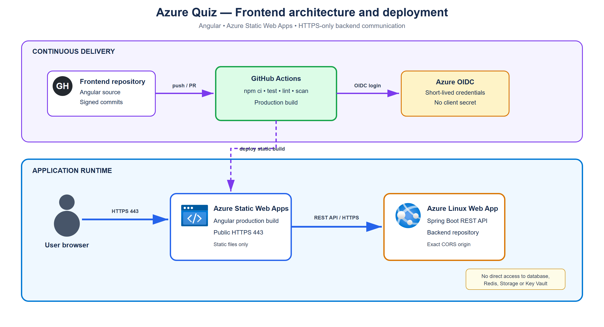

# Azure Quiz — Angular Frontend

Web interface for reviewing Microsoft certifications by module or mock exam. It is available without installation through Azure Static Web Apps.

## Status

- Application: [https://delightful-smoke-01664d103.7.azurestaticapps.net](https://delightful-smoke-01664d103.7.azurestaticapps.net)
- Backend API: [`/api/certifications`](https://app-azure-quiz-backend-nonprod.azurewebsites.net/api/certifications)
- Backend health: [`/actuator/health`](https://app-azure-quiz-backend-nonprod.azurewebsites.net/actuator/health)
- GitHub Actions pipeline validated through deployment and frontend/backend/CORS checks.

## Application architecture



Editable source: [application-architecture.drawio](docs/application-architecture.drawio).

```text
User browser
     |
     | HTTPS
     v
Angular / Azure Static Web Apps
     |
     | HTTPS REST API
     v
Spring Boot / Azure Linux Web App
     |
     +--> private Azure data services
```

The frontend consists of public static files. It therefore contains no password, Azure token, database key or other secret. It communicates only with the backend API; the backend URL may be public while all data services remain private.

The complete infrastructure is maintained in `bilan-azure-terraform`.

## Technology

- Angular 22 with standalone components and signals;
- Angular Material;
- ngx-translate for French and English;
- Vitest;
- ESLint, Prettier, Husky and lint-staged;
- Azure Static Web Apps.

## Run locally

Prerequisites: Node.js 22 and the backend running on `http://localhost:8080`.

```bash
npm ci
npm start
```

The application runs on `http://localhost:4200`. The development environment automatically targets the local API.

Local checks:

```bash
npm test
npm run lint
npm run format:check
npm run build:prod
```

The production build is generated in `dist/azure-quiz-frontend/browser` and targets:

```text
https://app-azure-quiz-backend-nonprod.azurewebsites.net/api
```

## Features

- certification selection;
- module browsing;
- module-based quizzes;
- mock exams;
- answer submission and correction;
- final result display;
- French and English interface.

## CI/CD pipeline

The [frontend-cicd.yml](.github/workflows/frontend-cicd.yml) workflow performs:

1. `npm ci` using the committed lockfile;
2. linting, formatting verification and Vitest tests;
3. Angular production build;
4. download of the reviewed build artifact;
5. deployment to Azure Static Web Apps;
6. frontend HTTPS availability check;
7. backend health and expected CORS header checks.

Pull Requests build and test without receiving the Azure deployment token. Deployment runs only from `main` through the protected GitHub environment `nonprod`.

The environment contains this secret:

```text
AZURE_STATIC_WEB_APPS_API_TOKEN
```

The token is never stored in source code, documentation, logs or Terraform state.

## Pre-production and production parity

The same source code, Angular build and deployment workflow can be used in production. Only environment values, URLs and deployment permissions change. This prevents pre-production from validating an artifact different from the one intended for users.

## Governance and security

- signed commits displayed as `Verified`;
- ownership declared in `CODEOWNERS`;
- Dependabot for npm, Docker and GitHub Actions;
- Trivy and Gitleaks on every push and Pull Request;
- protected `main` branch and deployment restricted to `nonprod`;
- no secrets in the browser bundle.

A failed test, scan, build, deployment or smoke test blocks the workflow and reports the malfunction through GitHub Actions.

## Main structure

- `src/app/core`: models, REST services and session state;
- `src/app/features/certifications`: certification selection;
- `src/app/features/modules`: modules and exam launch;
- `src/app/features/quiz`: question flow;
- `src/app/features/results`: final result;
- `public/staticwebapp.config.json`: Static Web Apps navigation rules.
